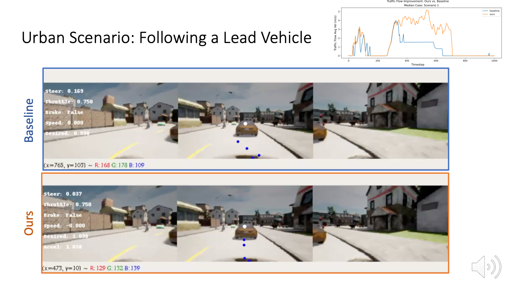
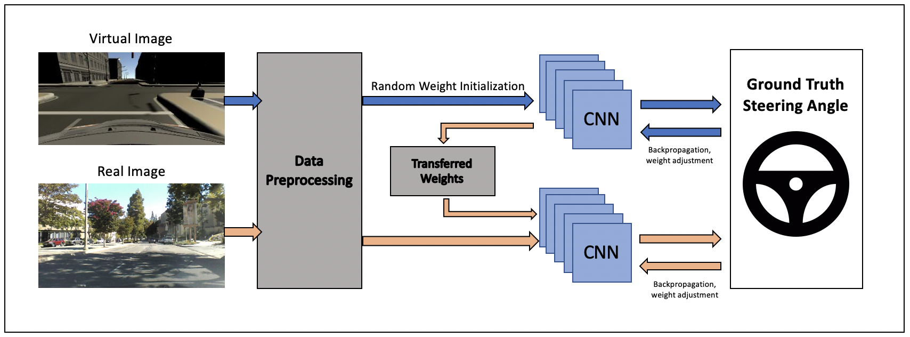
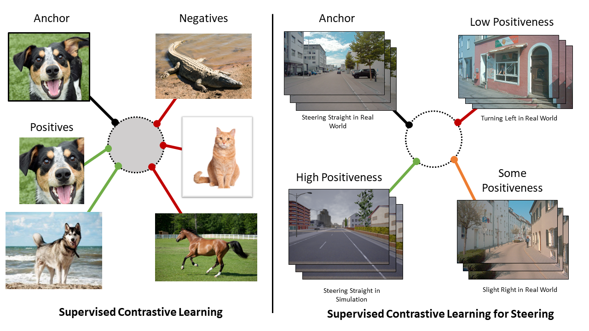
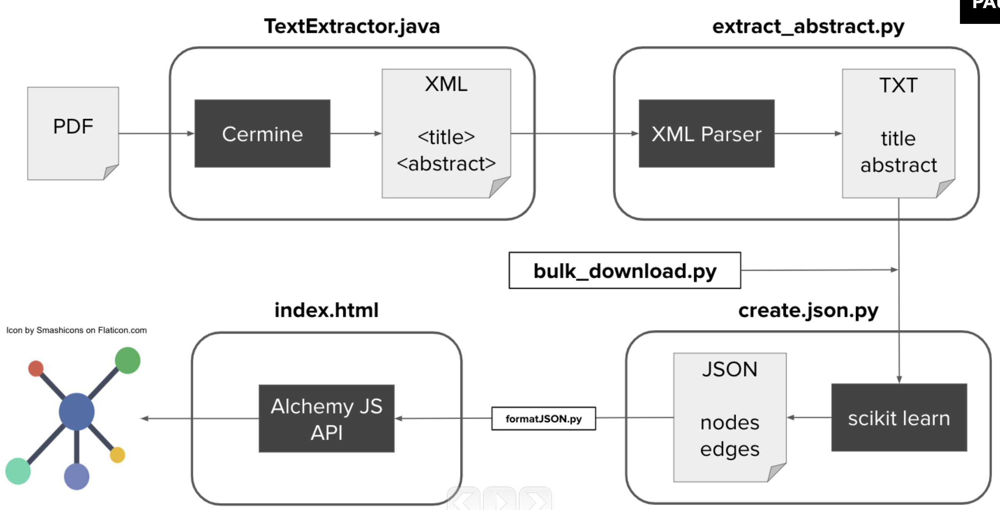
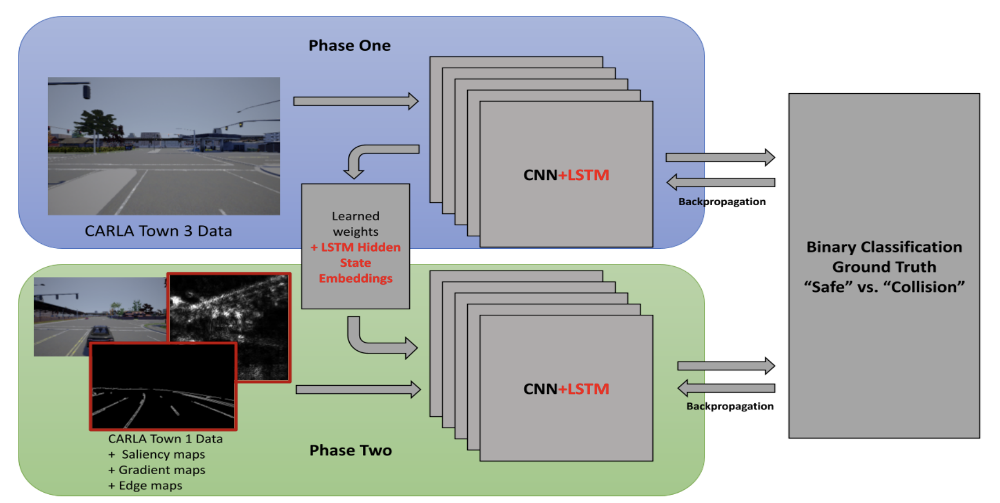
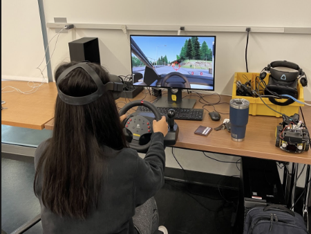
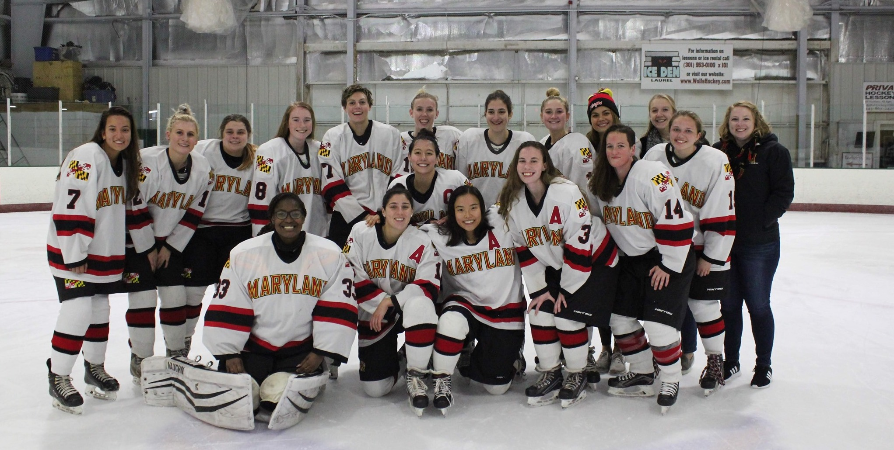

## About Me

I am currently a 3rd year Ph.D. student in Computer Science at the [University of Maryland](https://www.cs.umd.edu/), supervised by [Professor Ming Lin](https://www.cs.umd.edu/~lin/) at the [GAMMA Group](https://gamma.umd.edu/). My research interests include **learning-based behavioral cloning**, **invariance in computer vision**, and most recently **differentiable simulation**. Currently, I'm working on projects related to differentiable traffic simulation and leverage driving data collected via virtual reality. I am also self-studying reinforcement learning and skills with Unity or Unreal. 

<!-- <strong style="color:#e74d3c; font-weight:600">I am looking for a postdoc or research scientist position in the US and EU. I would appreciate a ping if you see a job I might fit.</strong> -->

## Education

**Ph.D in Computer Science**, Fall 2020 - Present  
University of Maryland, College Park  

**B.S. in Computer Science**, Fall 2016 - Fall 2019 
University of Maryland, College Park  
QUEST; CS; University Honors  

## News
- **[Jan. 2023]** Traffic-Aware AD paper is accepted to ICRA 2023! 🎉
<!-- - **[Dec. 2022]** Completed my Masters-along-the-way. -->
- **[Dec. 2022]**  I will be interning next summer at [Kitware](https://www.kitware.com/) with the Computer Vision team!
- **[Oct. 2022]**  I gave an oral presentation on exploring Contrastive Learning and Attention Networks for Self-Driving at [BADUE 2022](https://gamma.umd.edu/workshops/badue22/).
- **[Oct. 2022]** 3rd-time graduate mentor at Tech+Research for [Technica 2022](https://gotechnica.org/). The team which I mentored won the research-track award! Check out the DevPost for our mini-project on VR Driving [here](https://devpost.com/software/measuring-driver-behavior-through-vr-simulation).
<!-- - **[Oct. 2022]** Submitted a paper to [IEEE VR 2023](https://ieeevr.org/2023/). -->
<!-- - **[Sept. 2022]**  Submitted two papers to [ICRA 2023](https://www.icra2023.org/). -->

<h2 id="publications" style="margin: 2px 0px -15px;">Publications <temp style="font-size:15px;">[</temp><a href="https://scholar.google.com/citations?user=kGUj-dIAAAAJ&hl=en" target="_blank" style="font-size:15px;">Google Scholar</a><temp style="font-size:15px;">]</temp><temp style="font-size:15px;"></temp></h2>

<ol class="bibliography">

<li>

  

    
            <abbr class="badge">ICRA 2023</abbr>
  

  

      
Traffic-Aware Autonomous Driving with Differentiable Traffic Simulation

      
<strong>Laura Zheng</strong>, Sanghyun Son, Ming Lin 

      
<em> International Conference on Robotics and Automation <strong>(ICRA)</strong>, 2023.</em>
      

    

      <a href="https://arxiv.org/pdf/2210.03772.pdf" class="btn btn-sm z-depth-0" role="button" target="_blank" style="font-size:12px;">PDF</a>
      <a href="https://github.com/laurayuzheng/TrAAD" class="btn btn-sm z-depth-0" role="button" target="_blank" style="font-size:12px;">Code</a>
      <a href="https://gamma.umd.edu/trafficdriving/" class="btn btn-sm z-depth-0" role="button" target="_blank" style="font-size:12px;">Project</a>
    

  

</li>

 

<li>

  

    
            <abbr class="badge">NeurIPS</abbr>
  

  

      
<a href="https://proceedings.neurips.cc/paper/2021/hash/dce8af15f064d1accb98887a21029b08-Abstract.html ">Gradient-Free Adversarial Training Against Image Corruption for Learning-based Steering</a>

      
Yu Shen, <strong>Laura Zheng</strong>, Manli Shu, Weizi Li, Tom Goldstein, Ming Lin 

      
<em>Advances in Neural Information Processing Systems <strong>(NeurIPS)</strong>, 2021.</em>
      

    

      <a href="https://proceedings.neurips.cc/paper/2021/file/dce8af15f064d1accb98887a21029b08-Paper.pdf" class="btn btn-sm z-depth-0" role="button" target="_blank" style="font-size:12px;">PDF</a>
      <a href="https://github.com/YuShen0118/Multi_Perturbation_Robustness" class="btn btn-sm z-depth-0" role="button" target="_blank" style="font-size:12px;">Code</a>
      <a href="https://proceedings.neurips.cc/paper/13633-/bibtex" class="btn btn-sm z-depth-0" role="button" target="_blank" style="font-size:12px;">BibTex</a>
    

  

</li>

 

<li>

  

    
            <abbr class="badge">IROS</abbr>
  

  

      
<a href="https://ieeexplore.ieee.org/abstract/document/9341538">Enhanced Transfer Learning for Autonomous Driving with Systematic Accident Simulation</a>

      
Shivam Akhauri, <strong>Laura Zheng</strong>, Ming Lin 

      
<em>International Conference on Intelligent Robots and Systems <strong>(IROS)</strong>, 2020.</em>
      

    

      <a href="https://arxiv.org/pdf/2007.12148.pdf" class="btn btn-sm z-depth-0" role="button" target="_blank" style="font-size:12px;">PDF</a>
      <a href="https://gamma.umd.edu/etladsas/" class="btn btn-sm z-depth-0" role="button" target="_blank" style="font-size:12px;">Project</a>
    

  

</li>

</ol>

<h2 id="workshops" style="margin: 2px 0px -15px;">Oral Presentations<temp style="font-size:15px;"></temp><temp style="font-size:15px;"></temp></h2>

<ol class="bibliography">
<li>

  

    
            <abbr class="badge">BADUE</abbr>
  

  

      
Exploring Contrastive Learning and Attention Networks for Self-Driving Generalization

      
<strong>Laura Zheng</strong>, Yu Shen, Ming Lin 

      
<em> Behavior-Driven Autonomous Driving in Unstructured Environments <strong>(BADUE @ IROS)</strong>, 2022.</em>
      

    

      <a href="https://youtu.be/O9zZ6knHv54" class="btn btn-sm z-depth-0" role="button" target="_blank" style="font-size:12px;">Video</a>
    

  

</li>

 

<li>

  

    
            <abbr class="badge">AGU</abbr>
  

  

      
Understanding Machine Learning in Earth Science: A Natural Language Processing Approach

      
<strong>Laura Zheng</strong>, Arif Albayrak, William Teng, Mohammad Khayat, Long Pham 

      
<em> American Geophysical Union <strong>(AGU)</strong>, 2019.</em>
      

    

      <a href="https://ntrs.nasa.gov/citations/20200000390" class="btn btn-sm z-depth-0" role="button" target="_blank" style="font-size:12px;">Poster</a>
    

  

</li>

</ol>

<h2 id="unpublished" style="margin: 2px 0px -15px;">Ongoing Projects <temp style="font-size:15px;"></temp><temp style="font-size:15px;"></temp></h2>

<ol class="bibliography">

<li>

  

    
            <abbr class="badge">Unpublished</abbr>
  

  

      
Improving Generalization of Transfer Learning Across Domains Using Spatio-Temporal Features in Autonomous Driving

      
Shivam Akhauri, <strong>Laura Zheng</strong>, Ming Lin 

      
<em> International Conference on Robotics and Automation <strong>(ICRA)</strong>, 2023.</em>
      

    

      <a href="https://arxiv.org/pdf/2103.08116.pdf" class="btn btn-sm z-depth-0" role="button" target="_blank" style="font-size:12px;">PDF</a>
      <!-- <a href="https://github.com/" class="btn btn-sm z-depth-0" role="button" target="_blank" style="font-size:12px;">Code (TBD)</a> -->
      <a href="https://gamma.umd.edu/stltransfer/" class="btn btn-sm z-depth-0" role="button" target="_blank" style="font-size:12px;">Project</a>
    

  

</li>

  

<li>

  

    
            <abbr class="badge">In Progress</abbr>
  

  

      
Quantifying Human Driving Behavior through Virtual Reality

      
<strong>Laura Zheng</strong>, James Mullen, Julio Poveda, Shreelekha Revankar, Ming Lin 

      <!-- 
<em> International Conference on Robotics and Automation <strong>(ICRA)</strong>, 2023.</em> -->
      <!-- 
 -->
    <!-- 

      <a href="https://arxiv.org/pdf/2210.03772.pdf" class="btn btn-sm z-depth-0" role="button" target="_blank" style="font-size:12px;">PDF</a>
      <a href="https://github.com/" class="btn btn-sm z-depth-0" role="button" target="_blank" style="font-size:12px;">Code (TBD)</a>
      <a href="https://gamma.umd.edu/traffic_driving/" class="btn btn-sm z-depth-0" role="button" target="_blank" style="font-size:12px;">Project</a>
    
 -->
  

</li>

</ol>

## Teaching
- Teaching Assistant, [Learning-based Modeling, Simulation and Animation](http://www.cs.umd.edu/class/fall2022/cmsc828X/) for [Professor Ming Lin](http://www.cs.umd.edu/~lin/), Fall 2022
- Teaching Assistant, [Data Structures](http://www.cs.umd.edu/class/fall2021/cmsc420-0301/) for [Professor Hanan Samet](http://www.cs.umd.edu/~hjs/), Fall 2021
- Teaching Assistant, [Data Science](https://github.com/cmsc320/spring2022) for [Professor Jose Calderon](http://jmct.cc/), Spring 2022 and Spring 2021

## Honors and Awards 
- Selected to attend [CRA-W Grad Cohort for Women 2023](https://cra.org/cra-wp/grad-cohort-for-women/)
- Selected as Spotlight Talk at BADUE at IROS 2022
- CS Summer Research Fellowship, Fall 2021
- Grace Hopper Scholarship, Fall 2020 
- Admission to Cornell, Maryland, Max Planck Pre-doctoral Research School, Summer 2020 [[Certificate]](./assets/docs/cmmrs_zheng.pdf)
- Admission to QUEST Honors Program, Cohort 29, Fall 2017 
- President's Scholarship, Fall 2016 - Spring 2020

## Services

<h4 style="margin:0 10px 0;">Volunteering</h4>

<ul style="margin:0 0 5px;">
  <li> 3x Graduate Mentor at <a href="https://inclusion.cs.umd.edu/events/techresearch">Tech+Research</a> for <a href="https://gotechnica.org/">Technica @ UMD</a>, the largest hackathon for marginalized genders, 2020-2022 </li>
</ul>

<h4 style="margin:0 10px 0;">Conference Reviewing</h4>

<ul style="margin:0 0 5px;">
  <!-- <li><a href="https://ieeevr.org/2023/"><autocolor>IEEE Conference on Virtual Reality and 3D User Interfaces (IEEE VR) 2023</autocolor></a></li> -->
  <li><a href="https://gamma.umd.edu/workshops/badue22/"><autocolor> [Workshop] Behavior-Driven Autonomous Driving in Unstructured Environments (BADUE @ IROS) 2022</autocolor></a></li>
  <li><a href="https://www.iros2020.org/"><autocolor> IEEE International Conference on Intelligent Robots and Systems (IROS) 2020</autocolor></a></li>
</ul>

 

## Hobbies and Fun Facts

<!-- I used to compete in undergraduate collegiate league for Counter-Strike: GO in undergrad, and picked up VALORANT in 2020 for fun when the beta was out. I do not compete anymore, but I love following the main stream pro scene as well as the [Game Changers (GC)](https://playvalorant.com/en-us/news/esports/vct-game-changers/) scene. Game Changers is a league for marginalized genders and is dedicated to mitigating gender disparities and encouraging competitive participation from women and nonbinary players in VALORANT. I have genuinely enjoyed watching the growth and acceptance of marginalized genders in FPS in the last 2 years as a result of these initatives.  -->

FPS and RPG games are one of my favorite past times. Currently, I play VALORANT and Genshin Impact. Two of my favorite titles of all time are Legend of Zelda: Breath of the Wild, and [Enderal: Forgotten Stories](https://store.steampowered.com/app/933480/Enderal_Forgotten_Stories/), which started out as a Skyrim mod but has a beautiful storyline and fun combat mechanics. I can't recommend Enderal enough.. if you like Skyrim, you will love Enderal. 

I also played on the UMD women's club ice hockey team from 2016-2019 as left wing. It was a blast. Check out the team [Instagram](https://www.instagram.com/terpswhockey/) if you want to support! 
<!--  -->

  

Here's a playlist of various uploads from my childhood YouTube account, where I posted performance videos, gaming clips and the occasional travel vlog:

<iframe width="500" height="250" src="https://www.youtube.com/embed/videoseries?list=PLzr8pDcbqManQJOkOsQfV5pv38gbqUZuq" title="YouTube video player" frameborder="0" allow="accelerometer; autoplay; clipboard-write; encrypted-media; gyroscope; picture-in-picture" allowfullscreen></iframe>

